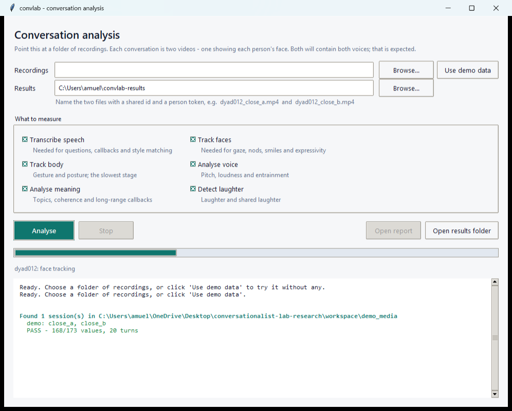
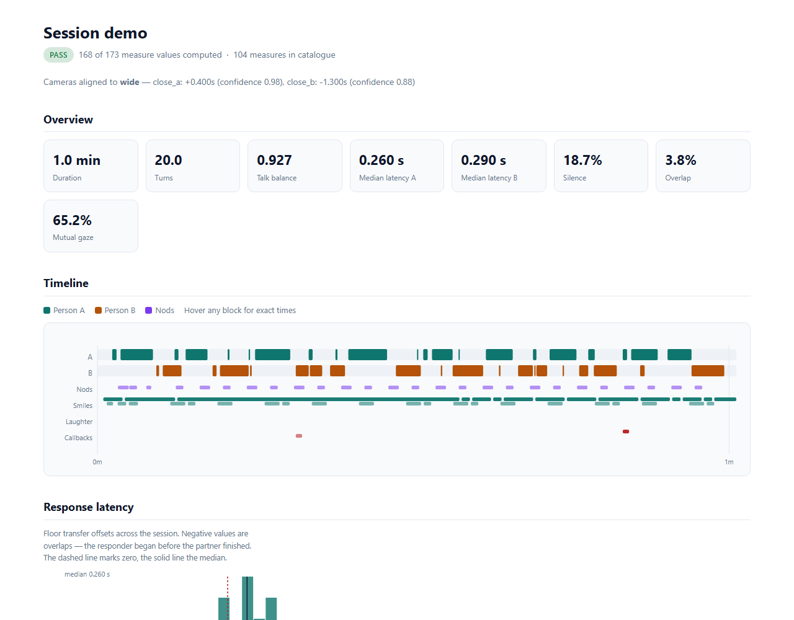

# convlab

**Measure what makes someone a good conversationalist, from video.**

Point it at a folder of recorded conversations — **two videos per pair, one
per person**. It works out who
spoke when, how quickly each replied, what they looked at, when they nodded,
smiled and laughed, how their speech and movement tracked one another, and
how all of that changed as the conversation went on — **104 measures**, each
defined and unit-labelled in a codebook, plus a visual report per pair.



---

# Install it

You need **Python 3.10 or newer**. Everything else the installer handles.

The first run downloads about **1.6 GB** of libraries and takes **15–30
minutes** on a normal connection. That happens once. After that the app opens
in seconds and runs entirely offline apart from a one-time 27 MB model
download. No GPU required.

## Windows

1. **Install Python** if you don't have it — [python.org/downloads](https://www.python.org/downloads/).
   On the first screen of the installer, **tick "Add python.exe to PATH"** before
   clicking Install. This is the step people miss.

2. **Download this project.** Either:
   - click the green **Code** button above → **Download ZIP** → right-click the
     downloaded file → **Extract All**, or
   - if you have Git: `git clone https://github.com/alexmueller07/conversationalist-lab-research.git`

3. **Open the folder** you just extracted or cloned.

4. **Double-click `launch-convlab.bat`.**

   The first run installs everything — you'll see a black window with progress
   text for 15–30 minutes. Leave it alone until the app appears. Every run
   after that opens in a couple of seconds.

   > If Windows shows a blue "Windows protected your PC" box, click
   > **More info** → **Run anyway**. That appears for any unsigned script.

## macOS

1. **Install Python with Tk support** (the version Apple ships is missing it):
   ```bash
   brew install python python-tk
   ```
   No Homebrew? Get it at [brew.sh](https://brew.sh), or install Python from
   [python.org](https://www.python.org/downloads/) which includes Tk.

2. **Download the project:**
   ```bash
   git clone https://github.com/alexmueller07/conversationalist-lab-research.git
   cd conversationalist-lab-research
   ```

3. **Start it:**
   ```bash
   chmod +x launch-convlab.sh
   ./launch-convlab.sh
   ```
   First run takes 5–15 minutes.

## Linux

```bash
sudo apt install python3 python3-venv python3-tk git    # Debian/Ubuntu
git clone https://github.com/alexmueller07/conversationalist-lab-research.git
cd conversationalist-lab-research
chmod +x launch-convlab.sh
./launch-convlab.sh
```

---

# Use it

## Try it with no data at all

Click **Use demo data**. It builds a synthetic two-person conversation using
your computer's speech voices, writes three video files, and analyses them.
Takes about four minutes start to finish. This is the fastest way to see what
the tool produces. *(Windows only — it needs the system speech engine.)*

## Analyse your own recordings

**1. Name your files.** Each conversation is **two videos** — one showing each
person's face. Give the pair a shared id and a person token:

```
recordings/
├── dyad012_close_a.mp4     person A's face
├── dyad012_close_b.mp4     person B's face
├── dyad013_close_a.mp4     next pair
├── dyad013_close_b.mp4
└── ...                     as many pairs as you like
```

Put every pair in the one folder — it processes all of them in a batch.

**Both files will contain both voices. That is expected.** Working out who is
speaking is the tool's job, and it handles the two setups differently:

- **In-person, one camera per person.** Each camera's microphone sits nearer
  its own participant, so the same voice arrives at the two microphones at
  different levels. That level difference is the primary cue and it is very
  strong (0.04 % speaker confusion).
- **Zoom, Teams, or any per-participant export.** These mix one shared audio
  feed into every participant's file, so the two recordings are *identical*
  in audio and the level cue does not exist at all. The tool detects this
  automatically and attributes speech from **which person's mouth is moving**
  instead, using the per-participant video.

You don't have to tell it which you have — it measures the level difference
and says which mode it used in the log and the quality report.

**Naming.** It recognises `close_a` / `cam_a` / `person_a` / `p1` for person A
and the `b` / `p2` equivalents for person B. It also handles files with **no
A/B token at all**, such as `<participant>_<session>.mp4`:

```
1101_101.mp4  +  1102_101.mp4       →  session 101
AN101_AN101.mp4 + AN102_AN101.mp4   →  session AN101
```

It works out which field identifies the session, pairs on it, and records
which participant became person A in the results (`meta_participant_a`). If
your filenames follow no pattern at all, use a
[manifest](#for-developers).

A third **wide** view showing both people is supported but not needed —
nothing measured depends on it. Against scripted conversations, two cameras
score within 0.002 of three on speech detection and identically on turn
detection.

**2. Click Browse** next to *Recordings* and choose that folder. The app
immediately lists what it found, so you'll know at once if a filename didn't
parse — not forty minutes later.

**3. Choose where results go** (or accept the default).

**4. Untick anything you don't need.** *Track body* is the slowest stage;
turning it off roughly halves the runtime.

**5. Click Analyse.** Progress and a running log appear as it works. **Stop**
is safe at any point — it finishes the current step and leaves valid output.

**6. Click Open report** when it finishes.

> **First run downloads about 27 MB of model files.** It happens once,
> automatically, and needs an internet connection. After that the app runs
> entirely offline.

## How long it takes

Roughly **four times the length of the recording**, on a normal laptop with no
graphics card. A 10-minute conversation takes about 35–40 minutes; a 118-pair
study is an overnight job. Re-running after changing a setting takes seconds,
because the slow steps are cached.

---

# What you get

```
results/
├── measures_all.csv        every pair, every measure — this is the one to analyse
├── codebook.csv            what all 104 measures mean
├── session_summary.csv     pass / review / fail per pair
└── dyad012/
    ├── dashboard.html      the visual report
    ├── tables/turns.csv    every turn, with its text and timing
    ├── tables/events.csv   nods, smiles, laughs, interruptions, callbacks
    ├── timeline.parquet    frame-level signals, for re-analysis
    ├── qc.json             every quality check and its result
    └── manifest.json       exact settings used, for reproducibility
```



`measures_all.csv` is long format — one row per pair, person and measure — so
it goes straight into a mixed-effects model. Dyadic data is non-independent,
so it wants a random intercept for the pair:

```r
library(lme4)
d <- read.csv("results/measures_all.csv")
lat <- subset(d, measure == "response_latency_median" & available)
summary(lmer(value ~ meta_condition + (1 | session_id), data = lat))
```

**Two conventions to know before analysing.** A measure that could not be
computed is a row with an empty value and a stated reason — never a zero, and
never a dropped row, because a failed camera and an absence of behaviour must
not look the same. And every pair carries a quality verdict based on the
*inputs* (sync confidence, tracking coverage, attribution certainty), not on
whether the numbers look plausible — filtering on surprising values is how a
real effect gets thrown away.

---

# What it measures

| Family | n | Examples |
|---|---|---|
| Turn taking | 17 | response latency median/IQR, talk-time balance, silence rate, longest lapse |
| Interruption | 7 | interruption vs transition overlap, success rate, floor retention |
| Backchannel | 6 | rate per minute of *partner* speech, coverage, placement within turn |
| Lexical | 16 | question rate and openness, hedging, fillers, pronouns, politeness, style matching |
| Prosody | 10 | pitch variability in semitones, jitter, shimmer, entrainment |
| Semantic | 12 | response coherence, topic count and duration, **long-range callbacks** |
| Gaze | 6 | gaze at partner while speaking vs listening, mutual gaze episodes |
| Head | 3 | nod rate while listening, head shakes |
| Facial expression | 5 | smiling, **Duchenne ratio**, expressivity, brow raises, shared smiling |
| Body | 3 | gesture rate, postural shifts, self-touch |
| Laughter | 4 | laughter rate, **shared laughter**, reciprocity |
| Synchrony | 7 | smile / head / expressivity / loudness coordination, **above chance** |
| Dynamics | 8 | change from the first third to the last: latency, silence, gaze, smiling |

Full definitions: [`docs/measures.md`](docs/measures.md).

Two deserve their own note.

**Long-range callbacks** — a turn that revives something dropped at least four
turns earlier. Embedding similarity alone is useless here: any two turns about
childhood look similar whether or not one *refers back* to the other. A
callback is counted only when three things hold together — the turns are far
apart, they share a rare content anchor, and **that anchor appears in no
intervening turn**, so the topic was genuinely dropped and then picked back
up. Scored against planted callbacks: **precision 0.97, recall 1.00**.

**Synchrony above chance** — two independent behavioural time series correlate
at around 0.3 simply because behaviour is autocorrelated. Reporting that as
mimicry isn't a weak result, it's an invalid one: the same number arises
between two people who never met. Every synchrony measure here is the *excess
over a surrogate baseline*, with a z score saying whether it clears that
baseline at all.

---

# The problem this solves

Each pair is filmed with one camera per person, and **every microphone picks
up both people**:

| View | Picture | Audio |
|---|---|---|
| `close_a` | person A's face | both voices |
| `close_b` | person B's face | both voices |
| `wide` *(optional)* | both people | both voices |

Nothing in the audio says whose voice it is, the cameras are started by hand
so files are offset by seconds, and their clocks drift. Nearly every measure
worth having is a *time difference*, so both problems have to be solved before
anything means anything.

**Alignment.** Full-length energy envelopes give a coarse offset that tolerates
gaps of tens of seconds; GCC-PHAT on several excerpts refines it to the
sample. Excerpt scatter becomes a confidence score, their slope a clock-drift
estimate. Recovery error on known offsets: **0.0 ms**.

**Who is speaking.** Each close-up mic sits nearer one person, so the same
voice reaches the two mics at different levels — a robust first pass, but
blind to simultaneous speech, since two people talking at once looks exactly
like one person talking ambiguously. A second pass therefore *unmixes* the two
channels into each person's own source power, which makes silence, A, B and
both genuinely distinguishable. Lip motion from each close-up joins as
independent evidence, and the result is decoded with an HMM so it stays
coherent instead of flickering mid-word.

Measured: **0.04 % speaker identity confusion**, **5.8 ms median turn-onset
error**, overlap detection at **0.97 precision**.

---

# Validation

`convlab validate` builds material whose answer is known by construction, runs
the real detectors on it, and scores them. All 21 checks pass:

| Check | Result |
|---|---|
| Camera sync recovery | 0.0 ms max error, offsets 0–11 s |
| Speech detection | F1 0.939 per person |
| Speaker identity confusion | 0.04 % |
| Overlap detection | precision 0.971, recall 0.606 |
| Turn detection | precision 0.894, recall 0.950 |
| **Turn onset accuracy** | **5.8 ms** median error |
| **Response latency accuracy** | **56 ms** median error |
| Backchannel detection | precision 0.964, recall 0.773 |
| Long-range callbacks | precision 0.967, recall 1.000 |
| Nod detection | precision 1.00, recall 1.00 |
| Nods vs single dips / shakes / drift | 0 false positives each |
| Synchrony false positive | \|z\| 1.06 on independent signals (raw r was 0.32) |
| Synchrony sensitivity | z 10.1, lag recovered exactly |

Validation audio is real speech rendered through the system voices and placed
at exact known times, so the whole chain runs on material every model accepts
while the answer stays known to the millisecond.

**What this does not establish.** Synthetic material cannot show a detector
works on human participants — it has no head turns, no accents, no overlapping
laughter, nobody leaning out of frame. What it does establish is that the path
from a known event to a reported number is correct, which is where silent
errors live: a sign flip, a boundary convention that shifts every latency by a
frame, a threshold that suppresses a whole class of event.

---

# Limitations

Stated plainly, because a measurement tool that oversells itself is worse than
useless.

- **Accuracy on real pairs is unmeasured.** Everything above is synthetic
  ground truth. Hand-coded recordings are the next step.
- **Laughter is under-detected** — quiet and breathy laughter is missed, so
  those rates are lower bounds.
- **Gaze is inferred, not calibrated.** Camera geometry isn't recorded, so "at
  the partner" is estimated from the mode of each person's own gaze
  distribution. It assumes people look at their partner more than anywhere
  else — usually true, and it fails on someone who stared at the table.
- **Duchenne classification is a proxy**, not a sincerity detector.
- **Lexical measures are English-only.** Applied to another language they
  would produce numbers that look valid and are not.
- **Body measures need the torso in frame.** They come from the close-up
  views, where attribution is certain; a tight head-and-shoulders shot yields
  low coverage and withheld measures — the honest outcome, not a bug.
- **These are proxies for behaviour, not scores of skill.** Almost none has a
  defensible "higher is better", which is why the codebook marks direction as
  unknown for most.

---

# For developers

The app is a thin shell over a library and a CLI.

```bash
pip install -e ".[semantic,dev]"

convlab gui                        # the desktop app
convlab analyse recordings/ -o out/
convlab analyse sessions.json -o out/     # explicit manifest
convlab demo -o out/
convlab validate                   # 21 ground-truth checks
convlab codebook -o docs/measures.md
pytest                             # 152 tests, no models or media needed
```

A manifest is the authoritative route when filenames aren't tidy, and it
carries study variables straight into the output tables. Paths resolve
relative to the manifest, so it can travel with the recordings:

```json
[{"session_id": "dyad012",
  "views": {"close_a": "MVI_0042.MP4", "close_b": "MVI_0117.MP4"},
  "metadata": {"condition": "control", "week": 3}},
 {"session_id": "dyad013",
  "views": {"close_a": "MVI_0208.MP4", "close_b": "MVI_0311.MP4"},
  "metadata": {"condition": "treatment", "week": 3}}]
```

Save it as `sessions.json` next to the videos and point the app or
`convlab analyse` at that file instead of the folder.

Pipeline order, and why:

```
probe → decode audio → align cameras → voice activity → face tracking
      → speaker attribution  (level unmixing + lip motion, HMM decoded)
      → turns → transcription → turns again
      → prosody · semantics · body · laughter
      → 104 measures → tables · codebook · QC · dashboard
```

Attribution runs *after* face tracking so mouth movement can inform it. Turn
construction runs *twice* because classifying backchannels needs the words and
transcribing needs the speech regions — a real circular dependency, resolved
by doing the cheap pass first.

Load-bearing design decisions:

- **Every stage caches** on a fingerprint of its inputs, the relevant config
  and its code version. Change a turn threshold and face tracking is reused.
- **A failing stage doesn't take the run down.** A corrupt wide camera still
  leaves turn-taking and prosody; failures are recorded, not swallowed.
- **All thresholds live in one typed config**, dumped into every run's
  `manifest.json`, so any number traces back to what produced it.
- **Model weights are pinned by SHA-256.** A silently changed upstream model
  would move every number, and a study spanning that change would contain two
  incomparable halves with nothing to say so.
- **Backchannels are excluded from turn construction.** Counting "mhm" as a
  turn inflates turn counts by about a third and pulls latency medians toward
  zero — the single convention that most changes the headline numbers.

No GPU required, and no `ffmpeg` on `PATH` (PyAV links the libraries directly,
a common silent failure on lab Windows machines).

- [`docs/METHODS.md`](docs/METHODS.md) — algorithms, thresholds, and their justification
- [`docs/measures.md`](docs/measures.md) — the full catalogue

---

Built for the Niedenthal Emotions Lab, UW–Madison.
Participant recordings never leave approved storage; nothing in this
repository contains or requires participant data.
